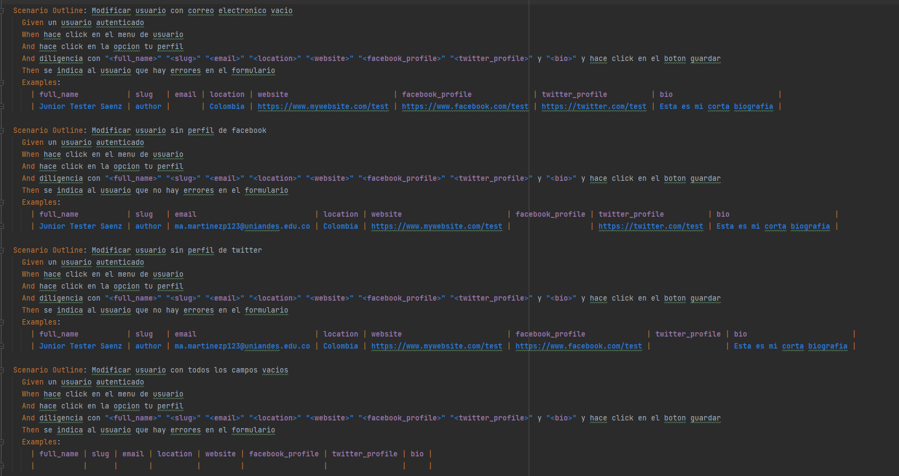
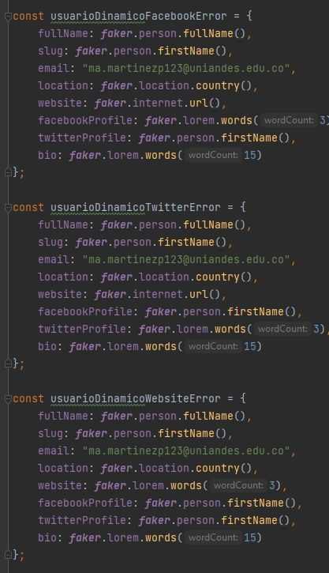
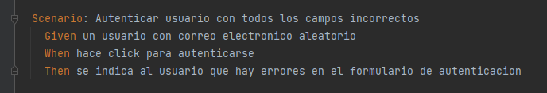
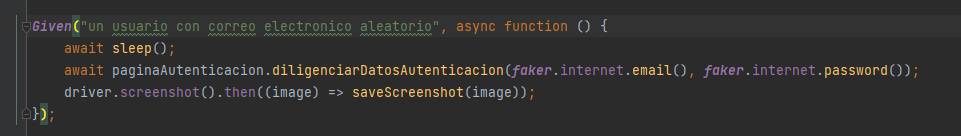

# Generación de Datos Aleatorios con Playwright

## Pool de datos a-priori

Como nosotros utilizamos Gherkin (Cucumber) para nuestros escenarios de pruebas utilizamos Scenario outlines con Examples.

## Pool de datos (pseudo) aleatorio dinámico

Para generar datos dinamicos generamos entidades completas con ayuda de Faker como se muestra a cotinuacion (No se modifico el dato email, ya que este es necesario para la autenticación exitosa):

Gracias a los metodos utilitarios de Faker y a la experiencia adquirida con Ghost pudimos generar datos aleatorios basicos antes de la ejecución de los escenarios, estas entidades pueden ser compartidas entre diferentes escenrios pero sus valores no van a cambiar durante la ejecucion.

## Escenario aleatorio

Para generar datos aleatorios definimos escenarios en los cuales sin importar el valor que se iba usar siempre generario el mismo estado por ejemplo en la autenticacion con datos invalidos. Estos datos se generan cuando se ejecuta el escenario utilizando Faker.

# Como ejecutar las pruebas
## Prerequisitos
1. Nodejs
2. Npm
3. Google Chrome
4. Ghost 3.41.1
## A tener en cuenta
Debe actualizar las constantes usuario y contrasena en el archivo __*stepdef.js*__ en las lineas 40 y 41 respoectivamente, por credenciales validas que tenga en su ambiente local para acceder a Ghost.

Recuerde de ser necesario tambien debe actualizar la constante baseUrl en el archivo __*stepdef.js*__ para utilizar el path de su ambiente local.

Debe cambiar todas las coincidencias del correo **ma.martinezp123@uniandes.edu.co** por el correo que utiliza para autenticarse en su version local en el archivo **usuarios.feature** ya que este actualiza informacion de autenticacion y si no se tiene el mismo puede llegar a generar error.

## Pasos
1. Luego de descargar una copia del proyecto dirijase al directorio **ghost-cucumber-playwright**.
2. Ingrese el comando __*npm install*__ para descargar las dependencias.
3. Ingrese el comando __*npm test*__ para ejecutar los escenarios de pruebas.

Hasta luego!

_**En caso de necesitar acceso al repositorio utilizar los siguientes datos usuarioexternouniandes@gmail.com y UniAndes2023*.**_

Esperamos disfruten calificando este entretenido repositorio.

Muchas Gracias. 
