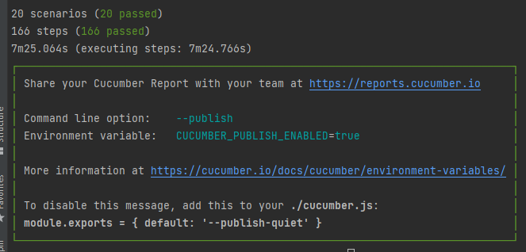

# Funcionalidades

## Publicaciones

- Listar publicaciones: permite al usuario ver y acceder a una lista de todas las publicaciones en el CMS.
- Crear publicacion: permite al usuario generar contenido nuevo en el CMS. Al utilizar esta herramienta, el usuario
  puede compartir ideas, pensamientos, opiniones o cualquier otro tipo de información relevante que desee comunicar a su
  audiencia en línea. Al crear un publicacion, el usuario puede agregar texto, imágenes, videos, enlaces y otros
  elementos multimedia para enriquecer el contenido y hacerlo más atractivo y completo.
- Modificar publicacion: permite al usuario editar y actualizar un contenido previamente publicado en el CMS. Al
  utilizar esta herramienta, el usuario puede corregir errores, agregar información adicional o actualizar el contenido
  para mantenerlo relevante y actualizado. Al modificar un publicacion, el usuario puede agregar o eliminar texto,
  imágenes, videos, enlaces y otros elementos multimedia, así como cambiar el formato, la tipografía y otros aspectos
  visuales para mejorar la calidad y la apariencia del contenido.
- Eliminar publicacion: permite al usuario eliminar un contenido previamente publicado en el CMS cuando ya no sea
  relevante.

## Paginas

- Listar paginas: permite al usuario ver y acceder a una lista de todas las páginas publicadas en el CMS.
- Crear pagina: Permite al usuario crear una página web personalizada en el CMS. Al utilizar esta herramienta, el
  usuario puede diseñar y personalizar una página que se adapte a sus necesidades, intereses y objetivos en línea. Al
  crear una página, el usuario puede agregar contenido multimedia, como texto, imágenes, videos, enlaces, formularios y
  otros elementos interactivos para hacer que la página sea más atractiva y funcional.
- Modificar pagina: Permite al usuario editar y actualizar una página web previamente creada en el CMS. Al utilizar esta
  herramienta, el usuario puede modificar el diseño, el contenido y los elementos multimedia de la página para
  mantenerla actualizada y relevante. Al modificar una página, el usuario puede agregar o eliminar secciones, cambiar la
  disposición y el diseño de los elementos, y actualizar el contenido, como el texto, las imágenes, los videos y otros
  elementos interactivos.
- Eliminar pagina: Permite al usuario eliminar una página web previamente creada en el CMS.

## Etiquetas

- Listar etiquetas: Permite al usuario ver y acceder a una lista de todas las etiquetas o palabras clave asignadas a un
  contenido específico en el CMS.
- Crear etiqueta: Permite al usuario asignar una etiqueta o palabra clave a un contenido específico en el CMS. Al
  utilizar esta herramienta, el usuario puede clasificar y organizar el contenido en la plataforma, lo que facilita la
  búsqueda y el acceso a la información por parte de la audiencia. Al crear un tag, el usuario puede agregar una palabra
  o frase que describa el contenido de manera precisa y concisa. Los tags suelen ser utilizados en combinación con otras
  funcionalidades, como la búsqueda o la categorización, para mejorar la accesibilidad y la navegación del contenido.
  Además, la funcionalidad de crear tag suele ofrecer opciones para crear tags personalizados, lo que permite al usuario
  crear etiquetas únicas y específicas para su contenido.
- Eliminar etiqueta: Permite al usuario eliminar una etiqueta o palabra clave previamente asignada a un contenido
  específico en el CMS. Al utilizar esta herramienta, el usuario puede deshacer una clasificación u organización del
  contenido en la plataforma, lo que puede ser útil en caso de que una etiqueta ya no sea relevante o si se cometió un
  error al asignarla.
- Modificar etiqueta: Permite al usuario editar y actualizar una etiqueta o palabra clave previamente asignada a un
  contenido específico en el CMS. Al utilizar esta herramienta, el usuario puede cambiar la descripción o el término
  utilizado para clasificar y organizar el contenido en la plataforma, lo que mejora la precisión y relevancia de la
  información para la audiencia. Al modificar un tag, el usuario puede cambiar la palabra o frase utilizada para
  describir el contenido, y así actualizar o mejorar la clasificación de este.

## Usuarios

- Modificar contraseña: Permite al usuario cambiar su contraseña para mantenerla segura.
- Cerrar sesion: Permite al usuario cerra sesion de forma segura para cuando termine su trabajo y nadie pueda acceder al
  sitio sin las credenciales adecuadas.
- Regenerar token de usuario: Permite regenerar el token al usuario para conceder acceso a la aplicacion sin la
  necesidad de conpartir sus credenciales de autenticación

# Escenarios de prueba

## Publicaciones

- Crear publicacion
- Eliminar publicacion
- Modificar publicacion
- Modificar publicacion con titulo de 285 caracteres
- Eliminar borrador publicacion

## Paginas

- Crear pagina
- Eliminar pagina
- Modificar pagina
- Modificar pagina con titulo de 285 caracteres
- Eliminar borrador pagina

## Etiquetas

- Crear etiqueta
- Eliminar etiqueta
- Modificar etiqueta
- Modificar etiqueta con titulo de 285 caracteres

## Usuarios

- Cerrar sesion de usuario
- Regenerar token de usuario
- Modificar contraseña de usuario con contraseña vieja incorrecta
- Modificar contraseña de usuario con verificacion de contraseña incorrecta
- Modificar contraseña de usuario con contrasena insegura
- Modificar contrasena de usuario

# Pros y contras de Selenium

## Pros

- La herramienta es muy facil de usar, de hecho la aprendimos a utilizar en una semana.
- Es soportada por diferentes lenguajes de programación.
- Utiliza diferentes navegadores para realizar las prueba.
- Es compatible con muchos sistemas operativos como Windows, Mac, Linux...
- Interactúa fácilmente con la aplicación web.
- La configuracion es sencilla.

## Contras

- En algunos casos se deben generar un timeout para que las pruebas no se estanquen y generen un error inesperado por no
  encontrar algun elemento no renderizado.
- No tiene una herramienta para generar un reporte integrada.

# Como ejecutar las pruebas
## Prerequisitos
1. Nodejs
2. Npm
3. Google Chrome
4. chromedrive (https://chromedriver.chromium.org/downloads)
## A tener en cuenta
Debe actualizar las constantes usuario y contrasena en el archivo __*stepdef.js*__ en las lineas 32 y 33 respoectivamente, por credenciales validas que tenga en su ambiente local para acceder a Ghost.
## Pasos
1. Luego de descargar una copia del proyecto dirijase al directorio root del mismo
2. Ingrese el comando __*npm install*__ para descargar las dependencias.
3. Ingrese el comando __*npm test ./features*__ para ejecutar los escenarios de pruebas. Obtendra un resultado como el siguiente

__Nota:__ Si tiene algun error por la version de chromedriver descargue la version adecuada en (https://chromedriver.chromium.org/downloads) y actulice el archivo en la carpeta del proyecto. Recuerde mantener el nombre chromedriver.exe

Hasta luego!